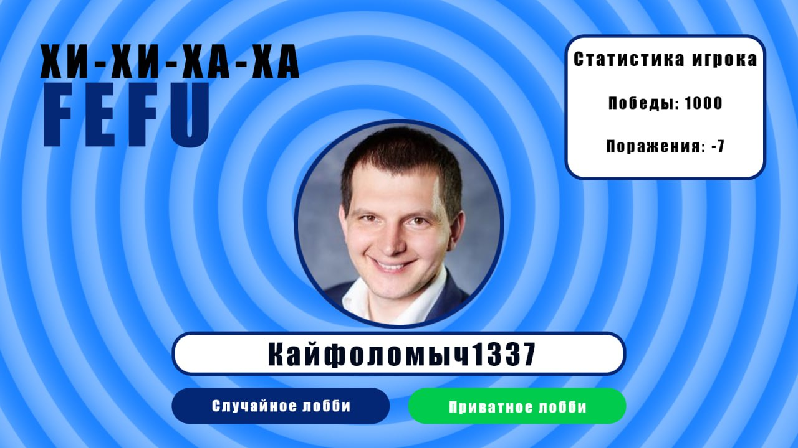
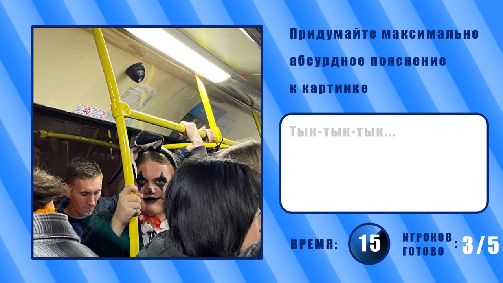

# ХИ-ХИ-ХА-ХА FEFU

 

`ХИ-ХИ-ХА-ХА FEFU` &mdash; это платформа, где люди могут собираться в виртуальных лобби, чтобы соревноваться в создании смешных подписей к картинкам или мемам. Этот сервис предлагает увлекательную и интерактивную игровую атмосферу, в которой участники могут проявить свою креативность и юмористический талант.

## Как работает ХИ-ХИ-ХА-ХА FEFU

- Регистрация и создание лобби: Пользователи могут зарегистрироваться на платформе и создать собственное лобби. Они могут выбрать количество участников в лобби и установить параметры игры, например, время на написание подписей к картинкам.

- Сбор в лобби: Участники могут присоединяться к созданным лобби. Когда все участники собраны, игра начинается.

- Назначение картинок и написание подписей: Каждому участнику лобби случайным образом назначается картинка или мем. У них есть определенное время (например, 30 секунд), чтобы придумать смешное описание или комментарий к этой картинке.

- Показ результатов: По истечении времени либо когда все участники закончили писать подписи, система в случайном порядке показывает картинки с  комментариями соответствующих участников. Участники, кроме автора подписи, могут оценить каждую комбинацию картинки и текста.

- Таблица с оценками: После оценок от всех участников игроки видят таблицу с результатами, где места распределяются в соответствии с оценками участников.

- Повторение и новые раунды: Игра может продолжаться с новыми картинками и новыми участниками после завершения раунда. Участники могут повторять игру в разных лобби.

`ХИ-ХИ-ХА-ХА FEFU` предлагает участникам возможность развлечься, проявить свою остроумность и конкурировать с другими игроками в создании смешных мемов. Этот сервис позволяет людям поделиться своим чувством юмора, посмеяться над чужими мемами и просто хорошо провести время в виртуальной среде.

